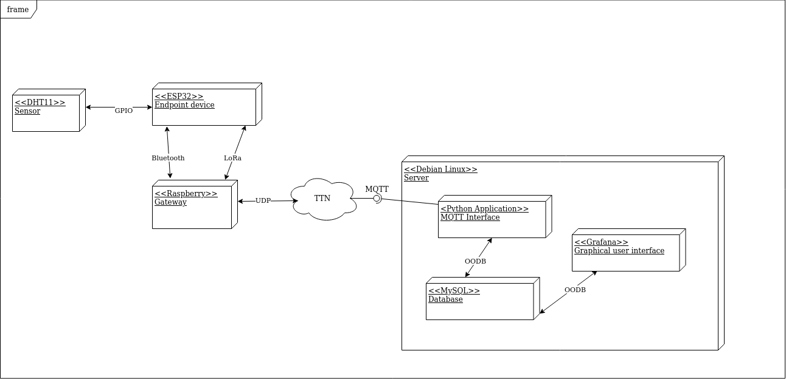
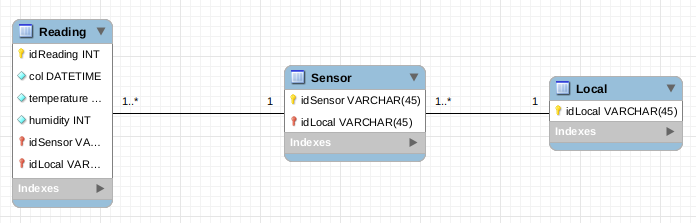
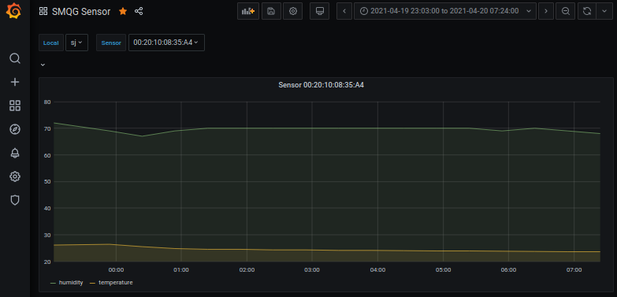

# Aplicação SMQG

O servidor de aplicação consiste em três módulos:
- Cliente MQTT
- Banco de dados MYSQL
- Interface gráfica Grafana

## Cliente MQTT
O cliente MQTT foi construído em python3 e consiste basicamente em se inscrever em um tópico MQTT e popular o modelo MYSQL com os dados recebidos.

Sintaxe de execução:
        
        python3 app.py <mysql-user> <mysql-pass> <mysql-model> <mqtt-broker> <mqtt-topic>

O cliente MQTT foi pensado para que cada grupo ou empresa contratante do SMQG utilize um único tópico MQTT, assim todos os dados de todos locais e sensores devem publicar utilizando este único tópico.

## Modelo do banco de dados
O banco de dados foi modelado utilizando o MYSQL e consiste apenas de três tabela sendo elas:

 - Local: representa um local de armazenamento de sacas de grãos.
 - Sensor: representa um sensor que realiza as leituras de ambiente em
   uma saca de grãos.    
 - Reading: representa o registro de uma leitura feita por um sensor.

O modelo foi pensado para que cada sensor possa ser utilizado em diferentes locais. 

Os celulares Android (gateways) utilizados para realizar as leituras não são registrados no banco de dados. Isso foi pensado para que qualquer gateaway possa ser utilizado em qualquer local e que mais de um gateway possa fazer leitura de um mesmo local. A informação do gateway não importa para a solução. 

## Grafana

Grafana é uma aplicação web de análise de código aberto multiplataforma e visualização interativa da web. Ele fornece tabelas, gráficos e alertas para a Web quando conectado a fontes de dados suportadas. É expansível através de um sistema de plug-in.

No dashboard desenvolvido é possível exbiri os dados de temperatura e humidate de todos os sensores e de todos os locais.
