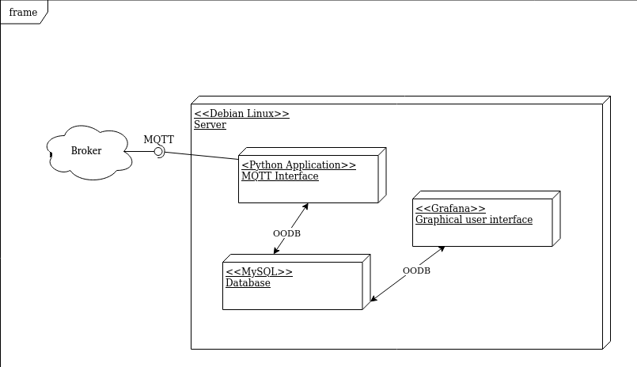

# SMQG Server

The architecture is a IoT publish/subscribe type.

## Requirements
Functional requirements:
- FR.01 The system application must persist the receveived endpoint data.
- FR.02 The system application must have a graphic interface to show the statistics of the endpoint data. 

Non-functional requirements:
- NFR.01 The user must be connected to the Internet to access the application GUI (graphic user interface).

## Deployment diagram

## Database model

